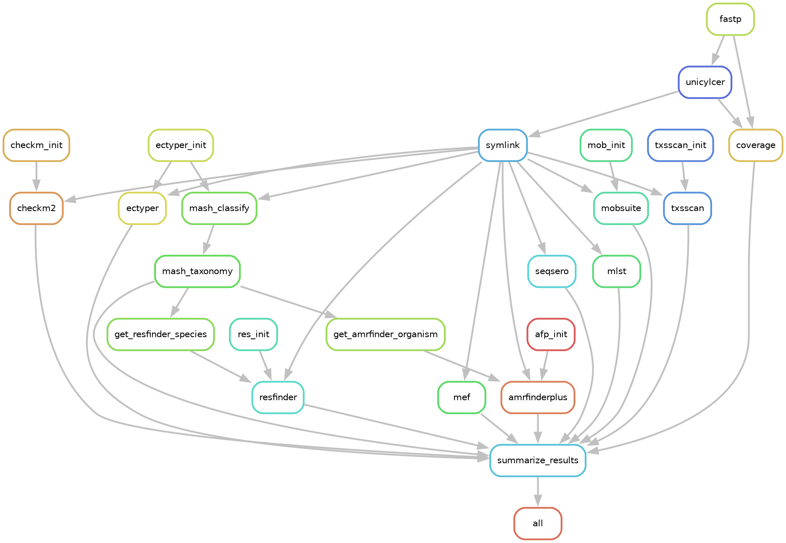

# SWAM-g: A Comprehensive Whole-Genome Sequencing Workflow for Environmental AMR Surveillance
This pipeline is designed to process Illumina paired-end whole-genome sequencing (WGS) data for the U.S. EPA's Surface Water AMR Monitoring (SWAM) system. It was constructed to be a robust, species-agnostic pipeline for assembling and annotating WGS data for antimicrobial resistance (AMR) monitoring. `SWAM-g` (SWAM-genome) calls several canonical pipelines, including NCBI's [AMRFinderPlus](https://github.com/ncbi/amr/tree/master), CGE's [ResFinder](https://github.com/genomicepidemiology/resfinder) and [MobileElementFinder](https://pypi.org/project/MobileElementFinder/), PHAC NML's [MOB-suite](https://github.com/phac-nml/mob-suite) and [ECTyper](https://github.com/phac-nml/ecoli_serotyping), [TXSScan](https://github.com/macsy-models/TXSScan), as well as [MLST](https://github.com/tseemann/mlst) for comprehensive assessment of AMR genotype, predicted phenotype, sequence type, and the presence and functionality of plasmids, protein secretion systems, and associated mobile genetic elements (MGEs). It leverages the circularity flags from the [SPAdes](https://github.com/ablab/spades/tree/main) wrapper, [Unicycler](https://github.com/rrwick/Unicycler?tab=readme-ov-file#installation), for accurate plasmid reconstruction and typing using [MOB-recon](https://github.com/phac-nml/mob-suite). `SWAM-g` uses [MASH screen](https://github.com/marbl/Mash) against a curated GTDB reference sketch for rapid speciation and [CheckM2](https://github.com/chklovski/CheckM2) for assembly quality assessment. The taxonomic assignments from MASH are fed to both [AMRFinderPlus](https://github.com/ncbi/amr/tree/master) and [ResFinder](https://github.com/genomicepidemiology/resfinder) to enable species-specific AMR profiling. If *Salmonella* or *E. coli* genomes are detected, `SWAM-g` will conditionally run [SeqSero2](https://github.com/denglab/SeqSero2/tree/master) for serotyping *Salmonella* or [ECTyper](https://github.com/phac-nml/ecoli_serotyping) for serotyping + pathotyping *E. coli*. All outputs are then collated into easy-to-use summary tables for downstream analysis.





## Setup and Configuration
**Note:** The pipeline is currently designed for Linux systems. macOS users can attempt adaptation but might face Snakemake system-specific dependencies. Windows is not officially supported. If you encounter issues, refer to the [Snakemake issues page](https://github.com/snakemake/snakemake/issues).

The peak memory requirement is approximately **20 GB** for MASH taxonomy classification; all other rules use substantially less.

### Step 0. Install conda/mamba manager, Snakemake, and SRA-tools
`SWAM-g` was constructed using [Snakemake](https://github.com/snakemake/snakemake) and relies entirely on conda environments.
Users should install either [miniforge](https://github.com/conda-forge/miniforge) or [miniconda](https://www.anaconda.com/docs/getting-started/miniconda/install#linux-2) if their shells are not already configured for Conda.

Code snippet for installing miniforge3 in your home directory and reconfiguring your shell:
```bash
cd ~
wget "https://github.com/conda-forge/miniforge/releases/latest/download/Miniforge3-Linux-x86_64.sh" -O installer.sh
bash installer.sh -b -p $HOME/miniforge3 && rm installer.sh
source ~/miniforge3/bin/activate
conda init && exec $SHELL
conda install "snakemake>=8" snakemake-executor-plugin-slurm sra-tools
```

> **HPC users:** `snakemake-executor-plugin-slurm` is required for the Slurm profile. If you are running on a local workstation only, it can be omitted.

### Step 1. Clone repo
Replace "/pathto/workspace" with where you want `SWAM-g` to live.

```bash
cd /pathto/workspace
git clone https://github.com/davis-bc/SWAM-g
```
### Step 2. Configure slurm profile and rule resources
`SWAM-g` was constructed and tested on an HPC cluster managed by a Slurm scheduler. Two Slurm profiles are provided — choose based on the number of samples in your run:

| Profile | Recommended for | Behavior |
|---------|----------------|----------|
| `config/slurm/large-batch` | **≥50 samples** | Annotation rules are batched 32 samples per Slurm job; Slurm receives the summed resources across all samples in a batch |
| `config/slurm/small-batch` | **<50 samples** | Each sample runs as its own individual Slurm job with per-job memory headroom |

Edit the `slurm_account` and `slurm_partition` fields in **both** profile configs to match your HPC environment. All resource allocation (`mem_mb`, `runtime`, `threads`) is controlled exclusively in the profile YAML — no edits to rule files are needed.

```yaml
default-resources:
  slurm_account: "your_account"
  slurm_partition: "your_partition"
```

More information on Snakemake configurations for different compute environments can be found in the [Snakemake docs](https://snakemake.readthedocs.io/en/stable/).

### Step 3. Tune resources (optional)
All per-rule resource allocations are defined in the profile config under `set-resources` and `set-threads`. Edit the appropriate profile file to adjust memory or runtime for any rule — no changes to `.smk` files are needed.

For example, to give `unicylcer` more RAM in the large-batch profile:
```yaml
# config/slurm/large-batch/config.yaml
set-resources:
  unicylcer:
    mem_mb: 200000
    runtime: "6-00:00:00"
```

### Step 4. Download test data, run the pipeline on HPC
To test the pipeline, first download example AMR-laden *E. coli*, *S. enterica*, and *E. faecalis* genomes using `fasterq-dump`. This will produce paired-end R1/R2 FASTQ files automatically:

```bash
mkdir -p /pathto/directory/input
cd /pathto/directory/input
fasterq-dump SRR30768419 SRR34965641 SRR7839461
```
`SWAM-g` takes a directory of paired-end FASTQs as input and a target directory for output. It currently cannot handle single-end Illumina or long-read datatypes.

The following is an example `run_swam-g.sh` driver script for executing `SWAM-g` via Slurm. Choose `large-batch` or `small-batch` based on the number of samples (see Step 2).

Replace "/pathto/" placeholders with appropriate paths.

```bash
#!/bin/bash
#SBATCH --account=###
#SBATCH --partition=###
#SBATCH --time=1-00:00:00
#SBATCH --cpus-per-task=1
#SBATCH --mem=20g
#SBATCH --job-name=snakemake_driver
#SBATCH --output=/pathto/workspace/slurm/snakemake.%j

cd /pathto/SWAM-g

input="/pathto/directory/input"
output="/pathto/directory/output"

# Use large-batch for ≥50 samples, small-batch for <50 samples
snakemake --profile config/slurm/large-batch \
          --config in_dir="$input" out_dir="$output" \
          --quiet

```
Then submit as:
```bash
sbatch run_swam-g.sh
```

### Step 5. Running on a local workstation
For running without Slurm (e.g., a laptop or single server), use the included `run_swam-g_local.sh` script. It uses the `config/local/` profile which caps CPU usage at 8 cores and RAM at 30 GB, and serializes the memory-intensive MASH classify step automatically.

```bash
bash run_swam-g_local.sh /path/to/input /path/to/output
```

If no arguments are provided, it defaults to `./input` and `./output` relative to the repository root.

---

## Software Versions

Key tools are pinned to specific versions in the conda environment files (`workflow/envs/*.yaml`) to ensure reproducibility. Tools installed via `pip` or marked with `>=` use the latest compatible release at environment creation time.

| Tool | Version | Notes |
|------|---------|-------|
| AMRFinderPlus | 4.2.7 (latest) | Exact pin |
| ECTyper | 2.0.0 (latest) | Exact pin |
| MacSyFinder (TXSScan) | 2.1.6 (latest) | Exact pin |
| MLST | 2.25.0 | Exact pin |
| CheckM2 | 1.1.0 (latest) | Minimum version |
| Unicycler | ≥0.5.0 | Minimum version |
| SPAdes | ≥3.14.0 | Minimum version |
| MASH | ≥2.3 | Minimum version |
| fastp | latest | Unpinned |
| Prodigal | latest | Unpinned |
| ResFinder | latest | Unpinned |
| MOB-suite | latest (pip) | Unpinned |
| MobileElementFinder | latest (pip) | Unpinned |
| SeqSero2 | git HEAD | Installed from source |


